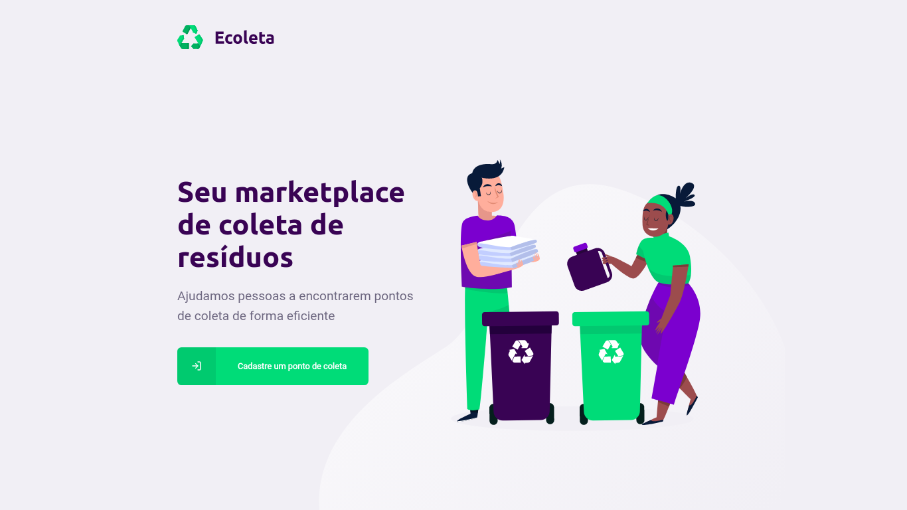
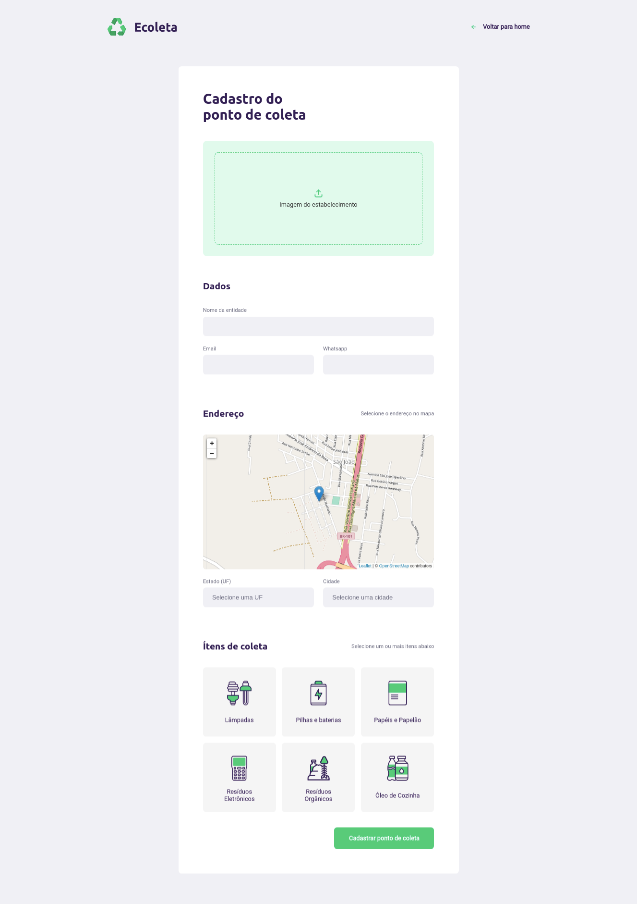
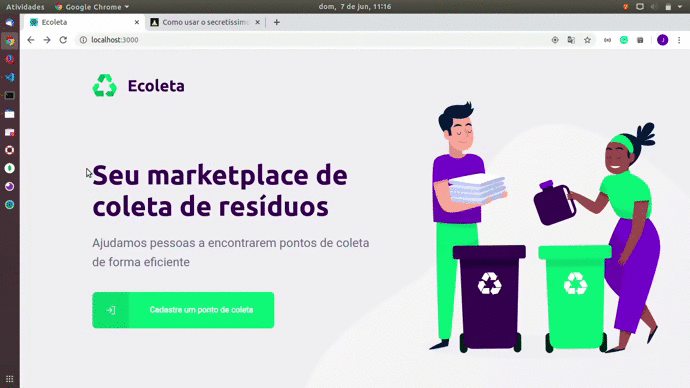

## 1. Back-end
Durante o desenvolvimento do back-end de Diego (CTO do RocketSeat), você aprendeu vários conceitos interessantes do Node.js + express, como integração com banco de dados para a realização de registros e busca de dados. Para lidar com consultas e inserir nenhum banco de dados, aprendi a usar uma biblioteca Knex.js que facilita muito a relação com o banco de dados.
1.2. Um pequeno desafio
Além do que foi passado pelo Diego, resolvi criar mais uma rota para excluir os pontos de coleta.
## 2. Web front-end
Para a contração do Front-end foi usado o ReactJS. Aprendi um pouco mais sobre rotas, conexão a API com axios, mapas e Hooks.

### 2.3. Aplicação rodando :smirk: 

## 3. Mobile
Certamente o desenvolvimento mobile foi o maior desafio para mim. Eu já possuia algum conhecimento básico sobre desenvolvimento mobile, mas com Flutter, por isso essa foi a parte do projeto que mais me deu trabalho :grimacing:, no entanto, foi onde eu mais aprendi coisas novas. 
 
 

