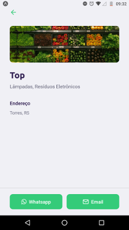

## 1. Back-end
Durante o desenvolvimento do back-end de Diego (CTO do RocketSeat), você aprendeu vários conceitos interessantes do Node.js + express, como integração com banco de dados para a realização de registros e busca de dados. Para lidar com consultas e inserir nenhum banco de dados, aprendi a usar uma biblioteca Knex.js que facilita muito a relação com o banco de dados.
1.2. Um pequeno desafio
Além do que foi passado pelo Diego, resolvi criar mais uma rota para excluir os pontos de coleta.
## 2. Web front-end
Para a contração do Front-end foi usado o ReactJS. Aprendi um pouco mais sobre rotas, conexão a API com axios, mapas e Hooks.

### 2.3. Aplicação rodando :smirk: 

## 3. Mobile
Certamente o desenvolvimento mobile foi o maior desafio para mim. Eu já possuia algum conhecimento básico sobre desenvolvimento mobile, mas com Flutter, por isso essa foi a parte do projeto que mais me deu trabalho :grimacing:, no entanto, foi onde eu mais aprendi coisas novas. 

 
 

## 4. Conclusão
Fazer o Next Level Week foi muito importante para meu crescimento como programador, tanto no quesito técnico, quanto na forma de como lidar com problemas. Além disso participar da comunidade no Discord foi excelente, interagir com outras pessoas que estão em busca de um mesmo objetivo é incrível. Portanto, só tenho a agradecer a [Rockeseat](https://rocketseat.com.br/) pelo conteúdo gratuito de ótima qualidade e que sem dúvidas me trouxe muito aprendizado.
